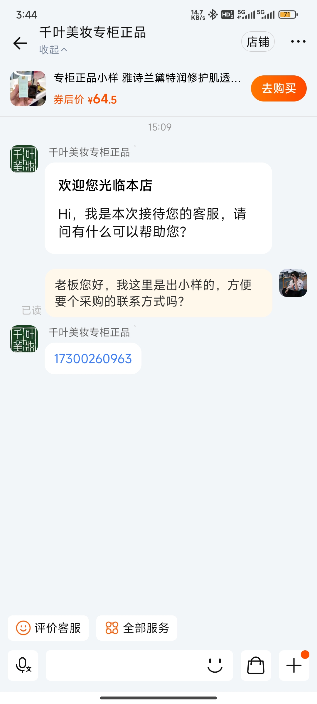
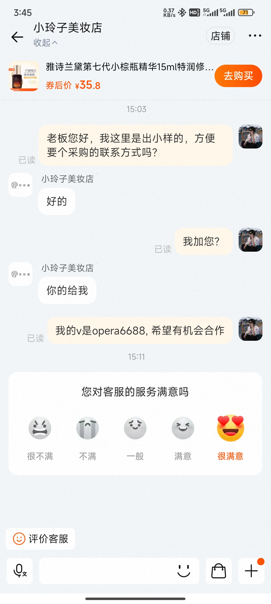
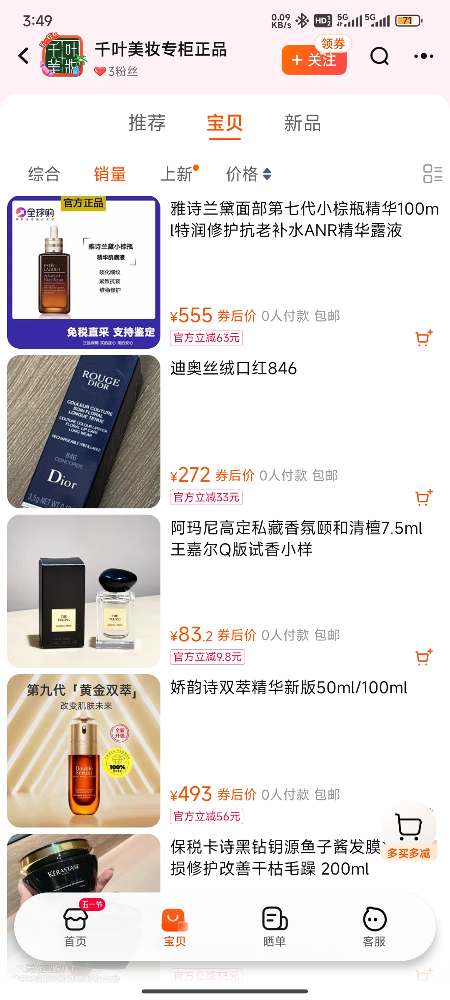

# Taobao
# 淘宝商家信息搜集操作指南  
  

## 一、核心目标  
通过关键词搜索淘宝店铺，与客服沟通获取采购联系方式，并按规范将信息反馈至群内。  

---

## 二、操作流程  
### 1. 关键词搜索  
- **步骤**：  
  1. 手机淘宝输入指定「关键词」，搜索店铺。  
  2. **去重检查**：搜索前核对表格，避免重复联系已记录的店铺。  

### 2. 联系客服  
- **步骤**：  
  1. 点击目标店铺 → 进入「客服」聊天界面。  
  2. **固定话术（必用）**：  
     > `“老板您好，我这里是出小样的，方便要个采购的联系方式吗？”`  

### 3. 处理客服回复  
#### 情况①：商家提供联系方式  
- **操作**：  
  1. 无需回复，截图聊天界面。  
  2. 进入店铺 →「宝贝」→ 按「销量」排序，截取3张商品图（若销量商品不符，改用「综合」排序）。  
- **提交要求**（按顺序发送6条信息至群内）  

#### 情况②：商家索要我方联系方式  
- **操作**：  
1. 回复：`“我的v是operad688，希望有机会合作”`  
2. 截图并提交至群内（6条信息）

#### 情况③：商家拒绝或已读不回  
- **操作**：  
1. 表格中标记“商家拒绝”，无需提交群内。  

---

## 三、关键注意事项  
### ⚠️ 禁止行为  
- 不联系旗舰店。  
- 自动回复中的联系方式无效，需人工回复。  

### ⚠️ 效率与规范  
- 群内信息按顺序发送，避免混乱。  
- 商品与关键词严重不符的店铺，直接跳过。  
- 成功率尽量保持30%，异常情况及时反馈更换关键词。  

---

## 四、薪资标准（日结）  
| 任务类型               | 单价  | 提交要求                     |  
|------------------------|-------|------------------------------|  
| 成功获取联系方式       | 6元   | 按流程提交6条信息至群内      |  
| 商家主动加微信         | 6元   | 按流程提交6条信息至群内      |  
| 商家拒绝/无回复        | 1元   | 仅需表格标记，无需提交群内   |  

---

## 五、示例参考  
### 1. 聊天截图示例  
- **商家同意**：  
>
- **商家主动加微信**：  
>

### 2. 商品销量截图要求  
- 截取按销量排序的前3张商品图（或综合排序）。  
- **示例**：
>

---

## 六、问题反馈  
- 特殊情况（如商家额外提问）或操作疑问，立即联系 **@卡日**。  
- 每日汇总问题，优化关键词策略。  

---

**提示**：操作前务必检查表格，避免重复劳动！  
**薪酬发放**：微信转账，当日结算。  
